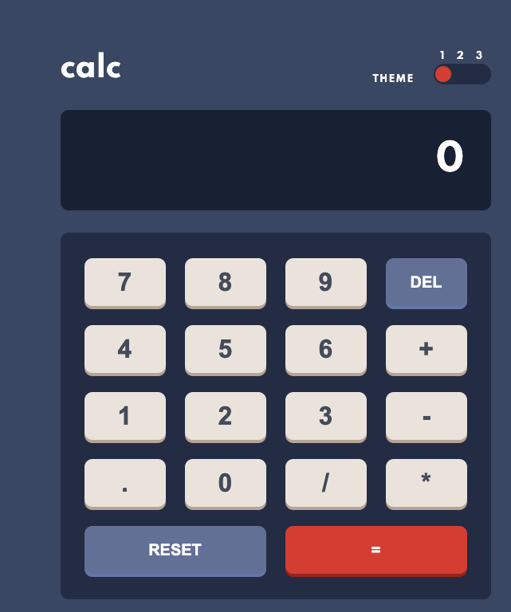

# Frontend Mentor - Calculator app solution

This is a solution to the [Calculator app challenge on Frontend Mentor](https://www.frontendmentor.io/challenges/calculator-app-9lteq5N29). Frontend Mentor challenges help you improve your coding skills by building realistic projects.

## Table of contents

- [Overview](#overview)
  - [The challenge](#the-challenge)
  - [Screenshot](#screenshot)
  - [Links](#links)
- [My process](#my-process)
  - [Built with](#built-with)
  - [What I learned](#what-i-learned)
  - [Continued development](#continued-development)
  - [Useful resources](#useful-resources)
- [Author](#author)
- [Acknowledgments](#acknowledgments)

## Overview

By performing this challenge I acquired js+css+html skill. I completed this challenge in vanilla JS, so no other frameworks used. Though in the future I'm planning to complete this challenge in React.
As a bonus I learned how to created a theme toggler switch, and to use global CSS variables, and how it is convenient to switch them by just few lines of JS code.
The challenge is made totally responsive according the requirements. Where the breakpoints considered as 600px, since it satisfies the lower px screens as well

### The challenge

Users should be able to:

- See the size of the elements adjust based on their device's screen size
- Perform mathmatical operations like addition, subtraction, multiplication, and division
- Adjust the color theme based on their preference

### Screenshot

### Links

- Solution URL: [Github repo](https://github.com/Yakub-Egamnazarov/frontEndMentor-Calculator.git)
- Live Site URL: [Website](https://tangerine-hotteok-c3b40d.netlify.app/)

## My process

### Built with

- Semantic HTML5 markup
- CSS custom properties
- Flexbox
- CSS Grid
- Desktop-first workflow
- Vanilla JavaScript implemented

### What I learned

I learned how to switch theme colors easily by JavaScript and CSS custom properties. Improved using HTML semantics. JS classes and objects.

### Continued development

I would implement key typing function. Right now the solution only provides mouse click inputs, however, using the same methods of the calculator object, I could connect the triggering on number key pressed.

### Useful resources

- [20 Best Toggle Switches](https://alvarotrigo.com/blog/toggle-switch-css/) - There are plenty of examples of the different toggle switches. Alvaro did a great job by collecting nice work in one page.
- [Dark and Light theme switcher](https://medium.com/@haxzie/dark-and-light-theme-switcher-using-css-variables-and-pure-javascript-zocada-dd0059d72fa2) - Musthad Ahamad created good tutorial about how to easily implement theme switching in website with big css properties.

- [Building Calculator with JS by WebDev Simplified](https://www.youtube.com/watch?v=j59qQ7YWLxw&ab_channel=WebDevSimplified) - In this channel, it is easily explained how to code a calculator in JS.

## Author

- Github page - [Yakub ](https://github.com/Yakub-Egamnazarov)
- Frontend Mentor - [Yakub Egamnazarov](https://www.frontendmentor.io/profile/Yakub-Egamnazarov)

## Acknowledgments

I would like to give credits for the resource makers, that they help to other developers to grow.
